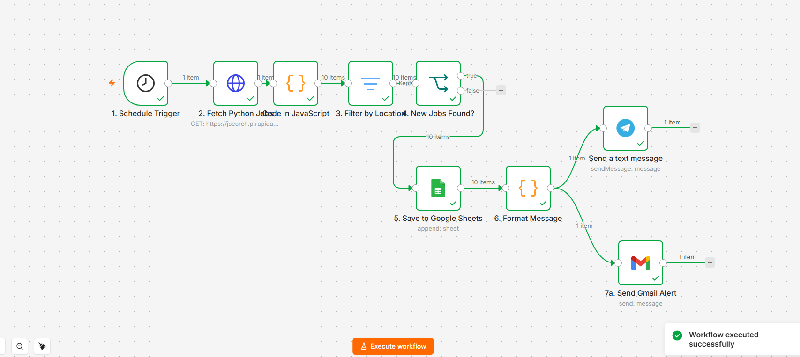

# 🐍 Python Job Alert Automation


> An intelligent job alert automation system built with n8n that automatically finds Python Developer jobs across India every morning and delivers real-time notifications via Gmail and Telegram — completely free and self-hosted on Railway.

---

## 📸 Workflow Preview

> 

```
⏰ Schedule Trigger (9AM Daily)
        ↓
🌐 HTTP Request → JSearch API (Python jobs in India)
        ↓
⚙️ Code Node → Split & flatten job array
        ↓
🔍 Filter → Remove irrelevant listings
        ↓
❓ IF Node → Jobs found today?
        ↓ YES
📊 Google Sheets → Save all jobs automatically
        ↓
🎨 Format Message → Build email + Telegram text
      ↙️           ↘️
📧 Gmail          📱 Telegram
(HTML digest)    (Instant alert)
```

---

## ✨ Features

- **🔄 Fully Automated** — Runs every day at 9AM without any manual intervention
- **🇮🇳 India Focused** — Filters Python Developer jobs specifically from Indian job market
- **📊 Auto Tracking** — All jobs saved to Google Sheets for easy tracking and follow-up
- **📧 Gmail Digest** — Beautiful HTML email with all job listings delivered daily
- **📱 Telegram Alerts** — Instant notifications with job title, company and apply link
- **☁️ Self Hosted** — Deployed free forever on Railway with Postgres database
- **⚡ Fast Setup** — Import workflow JSON and configure credentials in minutes

---

## 🏗️ Tech Stack

| Technology | Purpose |
|---|---|
| **n8n** | Workflow automation engine |
| **JSearch API (RapidAPI)** | Job listings data source |
| **Google Sheets API** | Job tracker database |
| **Gmail API** | Daily email digest |
| **Telegram Bot API** | Instant push notifications |
| **Railway** | Free cloud hosting |
| **PostgreSQL** | n8n workflow database |

---

## 🚀 Getting Started

### Prerequisites
- n8n account (self-hosted on Railway — free)
- RapidAPI account (JSearch API — free tier)
- Google Cloud Console account (for Sheets + Gmail)
- Telegram account (for bot notifications)

---

### Step 1 — Deploy n8n on Railway

1. Go to [railway.app](https://railway.app)
2. Sign up with Google
3. Click **New Project** → **Template** → search **n8n**
4. Click **Deploy** — Railway sets up n8n + Postgres automatically
5. Open your n8n URL (e.g. `n8n-production-xxxx.up.railway.app`)

---

### Step 2 — Import Workflow

1. Download `python_job_alert_workflow.json` from this repo
2. In n8n click **+** → **Import from file**
3. Upload the JSON file
4. All nodes will appear automatically

---

### Step 3 — Configure Credentials

#### RapidAPI (JSearch)
1. Go to [rapidapi.com](https://rapidapi.com)
2. Search **JSearch** → Subscribe to free tier
3. Copy your `X-RapidAPI-Key`
4. In n8n HTTP Request node → add header with your key

#### Google Sheets + Gmail
1. Go to [console.cloud.google.com](https://console.cloud.google.com)
2. Create new project → Enable **Google Sheets API** + **Gmail API**
3. Create OAuth 2.0 credentials
4. Add your Railway n8n URL as redirect URI:
```
https://your-n8n.railway.app/rest/oauth2-credential/callback
```
5. Add yourself as test user in OAuth consent screen
6. Connect in n8n credentials

#### Telegram Bot
1. Open Telegram → search **BotFather**
2. Type `/newbot` → follow instructions
3. Copy your bot token
4. Search **userinfobot** → get your Chat ID
5. Add both in n8n Telegram credential

---

### Step 4 — Create Google Sheet

Create a new Google Sheet named **"Python Job Tracker"** with these headers in Row 1:

| A | B | C | D | E | F | G |
|---|---|---|---|---|---|---|
| Date | Job | Title | Company | Location | Remote | Apply Link | Salary |

---

### Step 5 — Activate Workflow

1. Click **Publish** button in n8n
2. Workflow runs every day at 9AM automatically
3. Check your Gmail and Telegram for job alerts!

---

## 📊 Sample Output

### Telegram Message
```
🐍 Python Jobs Today — Sat May 16 2026

1. AI Backend Developer (Python / FastAPI)
🏢 Unify Group
📍 India
🔗 https://in.indeed.com/viewjob?jk=...

2. Python Developer Intern | Remote
🏢 Inficore Soft
📍 Remote
🔗 https://bebee.com/jobs/...
```

### Google Sheets Tracker
| Date | Job | Company | Location | Remote | Apply Link |
|---|---|---|---|---|---|
| 5/16/2026 | AI Backend Developer | Unify Group | India | No | https://... |
| 5/16/2026 | Python Developer Intern | Inficore Soft | Remote | Yes | https://... |

---

## ⚙️ Workflow Configuration

### Customise Job Search
In the **HTTP Request** node, modify these parameters:

| Parameter | Default | Options |
|---|---|---|
| `query` | `Python Developer` | Django Developer, FastAPI Engineer, etc. |
| `country` | `in` | `us`, `uk`, `ca`, etc. |
| `date_posted` | `today` | `3days`, `week`, `month` |
| `num_pages` | `1` | `1-10` |

### Customise Schedule
In **Schedule Trigger** node:
- Change hour to any time you prefer
- Can also run multiple times per day

---

## 🔧 Workflow Nodes Explained

| Node | Type | Function |
|---|---|---|
| Schedule Trigger | Trigger | Runs workflow at 9AM daily |
| Fetch Python Jobs | HTTP Request | Calls JSearch API for Python jobs |
| Code in JavaScript | Code | Splits job array into individual items |
| Filter by Location | Filter | Removes irrelevant job listings |
| New Jobs Found? | IF | Checks if any jobs were found |
| Save to Google Sheets | Google Sheets | Appends each job as new row |
| Format Message | Code | Builds HTML email + Telegram text |
| Send Gmail Alert | Gmail | Sends formatted HTML email digest |
| Send a text message | Telegram | Sends instant job notification |

---

## 📁 Repository Structure

```
python-job-alert-automation/
│
├── python_job_alert_workflow.json    # Import this into n8n
├── README.md                          # This file
└── screenshots/
    └── workflow.png                   # n8n workflow screenshot
```

---

## 🌟 Why I Built This

As a Python Developer actively looking for opportunities, I built this automation to:
- Save hours of manual job searching every day
- Never miss a relevant Python job posting
- Track all applications in one place
- Practice real-world Python automation skills

This project demonstrates practical skills in API integration, workflow automation, cloud deployment, and data management.

---

## 🔮 Future Improvements

- [ ] Add Naukri.com as additional job source
- [ ] AI-powered job relevance scoring
- [ ] Auto-generate cover letters for matching jobs
- [ ] WhatsApp notifications via Twilio
- [ ] Dashboard with job application analytics
- [ ] LinkedIn job scraping integration

---

## 👨‍💻 Author

**Suraj Kumar Gupta**
- 🔗 LinkedIn: [linkedin.com/in/sk-gupta-821a4965](https://linkedin.com/in/sk-gupta-821a4965)
- 🐙 GitHub: [@surajgupta221](https://github.com/surajgupta221)
- 📧 Open to Python Developer / Full Stack / AI roles

---

## 📄 License

MIT License — feel free to use and modify for your own job search!

---

⭐ If this helped you, please give it a star and share with others on the job hunt!
